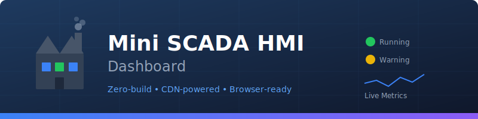

<p align="center">
  
</p>

<h1 align="center">🏭 Mini SCADA HMI Dashboard</h1>

<p align="center">
  <strong>A zero-build, browser-ready demo of a SCADA Human-Machine Interface for factory monitoring</strong>
</p>

<p align="center">
  <a href="#-quick-start">Quick Start</a> •
  <a href="#-features">Features</a> •
  <a href="#-screenshots">Screenshots</a> •
  <a href="#-contributing">Contributing</a>
</p>

<p align="center">
  
  
  
  
  
</p>

---

## 🤔 What is this?

**Mini SCADA HMI Dashboard** is a **learning-friendly demonstration** of how industrial monitoring systems work. It's designed for:

- 🎓 **Students** learning about industrial automation and SCADA systems
- 💼 **Developers** exploring HMI/SCADA UI patterns without enterprise software
- 🏭 **Engineers** prototyping dashboard layouts before committing to expensive tools
- 🧪 **Trainers** demonstrating operator interfaces in a safe sandbox

> **SCADA** = Supervisory Control and Data Acquisition  
> **HMI** = Human-Machine Interface

This is a **simulated demo** – no real industrial equipment is harmed (or controlled) in the making of this dashboard! 😄

---

## ⚡ Quick Start

Getting started takes **less than 30 seconds**:

### Option 1: Download & Open (Recommended for beginners)

1. Click the green **"Code"** button above → **"Download ZIP"**
2. Unzip the folder anywhere on your computer
3. Double-click `index.html` to open in your browser
4. **That's it!** 🎉

### Option 2: Clone with Git

```bash
git clone https://github.com/chf3198/mini-scada-hmi-dashboard.git
cd mini-scada-hmi-dashboard
# Open index.html in your browser (no server needed!)
open index.html        # macOS
xdg-open index.html    # Linux
start index.html       # Windows
```

> **💡 Pro tip:** Works perfectly via `file://` protocol – no web server required!

---

## ✨ Features

<table>
<tr>
<td width="50%">

### 📊 **Real-Time Dashboard**
- Live machine status cards with health scores
- Color-coded severity indicators (🔴 Critical → 🟢 OK)
- Animated charts for downtime and events
- Automatic refresh during simulation

</td>
<td width="50%">

### 🔔 **Alarm Management**
- Severity-based event logging
- One-click alarm acknowledgment
- Timestamp tracking with relative time display
- Filter events by machine

</td>
</tr>
<tr>
<td width="50%">

### 📋 **Runbooks (SOPs)**
- Searchable troubleshooting guides
- Accordion-style expandable sections
- Step-by-step procedures for common issues
- Ready for your custom procedures

</td>
<td width="50%">

### ✅ **Commissioning Checklists**
- FAT/SAT-style validation checklists
- Progress bars per section and overall
- LocalStorage persistence (survives page refresh!)
- JSON export/import for sharing

</td>
</tr>
<tr>
<td width="50%">

### 🎮 **Simulation Mode**
- Start/stop realistic event generation
- Random alarm triggers and machine status changes
- Perfect for demos and training
- Visual indicators show simulation is active

</td>
<td width="50%">

### 🌙 **Operator-Friendly UI**
- Dark mode for night shifts
- Responsive design (works on tablets too)
- Tooltips explain SCADA terminology
- Built-in Help/User Manual page

</td>
</tr>
</table>

---

## 🖥️ Screenshots

| Overview Dashboard | Machine Detail |
|:------------------:|:--------------:|
|  |  |

> 📸 **Note:** These are placeholder images. Replace with actual screenshots after running the app!

---

## 🗂️ Project Structure

```
mini-scada-hmi-dashboard/
├── 📄 index.html          # Entry point - just open this!
├── 📁 assets/
│   ├── app.js             # Main app logic, routing, views
│   ├── data.js            # Seed data (machines, events, runbooks)
│   ├── utils.js           # Helpers, simulation, persistence
│   ├── styles.css         # Minimal custom styles
│   └── tests.js           # Self-tests (run with ?test=1)
├── 📁 docs/
│   └── *.png              # Screenshots
├── 📄 LICENSE             # MIT License
├── 📄 README.md           # You are here!
└── 📄 CONTRIBUTING.md     # How to contribute
```

**Total codebase: ~800 lines** – small enough to read in an afternoon!

---

## 🛠️ Technology Stack

All dependencies loaded via CDN – **no npm, no webpack, no bundlers!**

| Library | Purpose | Why We Chose It |
|---------|---------|-----------------|
| [Tailwind CSS](https://tailwindcss.com/) | Styling | Utility-first, no build needed |
| [Chart.js](https://www.chartjs.org/) | Charts | Simple, beautiful, well-documented |
| [Lucide Icons](https://lucide.dev/) | Icons | Clean, open-source icon set |
| [Tippy.js](https://atomiks.github.io/tippyjs/) | Tooltips | Accessible, customizable tooltips |
| [Alpine.js](https://alpinejs.dev/) | Reactivity | Minimal, declarative JS framework |

---

## 🧪 Running Tests

The project includes lightweight self-tests:

```
# Open in browser with test flag
index.html?test=1
```

Check the browser console for test results. All tests should pass ✅

---

## 🚀 Customization Ideas

Want to make it your own? Here are some ideas:

| Customization | Difficulty | File to Edit |
|---------------|------------|--------------|
| Add more machines | ⭐ Easy | `assets/data.js` |
| Create new runbooks | ⭐ Easy | `assets/data.js` |
| Change color scheme | ⭐ Easy | Tailwind classes in `app.js` |
| Add new dashboard views | ⭐⭐ Medium | `assets/app.js` |
| Connect to real MQTT broker | ⭐⭐⭐ Advanced | New integration needed |
| Add OPC-UA data source | ⭐⭐⭐ Advanced | Backend required |

---

## 🏭 From Demo to Production

This demo is **educational only**. For real industrial use, you'd need:

| Requirement | Description |
|-------------|-------------|
| 🔌 **OPC-UA / MQTT** | Real protocol connections for live PLC data |
| 🔐 **Authentication** | User login, role-based access (operators vs. admins) |
| 💾 **Historian DB** | Store events/downtime in SQL/NoSQL for analysis |
| ⚡ **WebSockets** | Push updates instead of polling |
| 🖥️ **Backend API** | Node.js/Python for data processing |
| 🔄 **Redundancy** | High-availability for critical systems |

---

## 🤝 Contributing

Contributions are welcome! Whether it's:

- 🐛 Bug reports
- 💡 Feature suggestions  
- 📖 Documentation improvements
- 🎨 UI/UX enhancements

Please read [CONTRIBUTING.md](CONTRIBUTING.md) before submitting a pull request.

---

## 📜 License

This project is licensed under the **MIT License** – see [LICENSE](LICENSE) for details.

Feel free to use, modify, and distribute!

---

## 💬 Glossary

New to SCADA? Here are the key terms:

| Term | Definition |
|------|------------|
| **SCADA** | Supervisory Control and Data Acquisition – systems that monitor and control industrial processes |
| **HMI** | Human-Machine Interface – the screen operators use to interact with machines |
| **PLC** | Programmable Logic Controller – industrial computer that controls machinery |
| **OPC-UA** | Open Platform Communications Unified Architecture – industrial data exchange standard |
| **FAT** | Factory Acceptance Test – validation before shipping equipment |
| **SAT** | Site Acceptance Test – validation after installation on-site |

---

## � Author

**Curtis Franks**

- GitHub: [@chf3198](https://github.com/chf3198)
- Email: curtisfranks@gmail.com

---

## 🙏 Acknowledgments

- Industrial automation professionals who shared SCADA/HMI best practices
- The open-source community for amazing CDN libraries
- Factory operators who inspired the "operator-friendly" design philosophy

---

## 📄 License

This project is licensed under the MIT License - see the [LICENSE](LICENSE) file for details.

Copyright © 2026 Curtis Franks

---

<p align="center">
  <strong>⭐ Found this useful? Give it a star!</strong><br>
  <sub>Built with ❤️ for the industrial automation community</sub>
</p>
