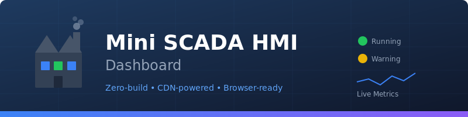
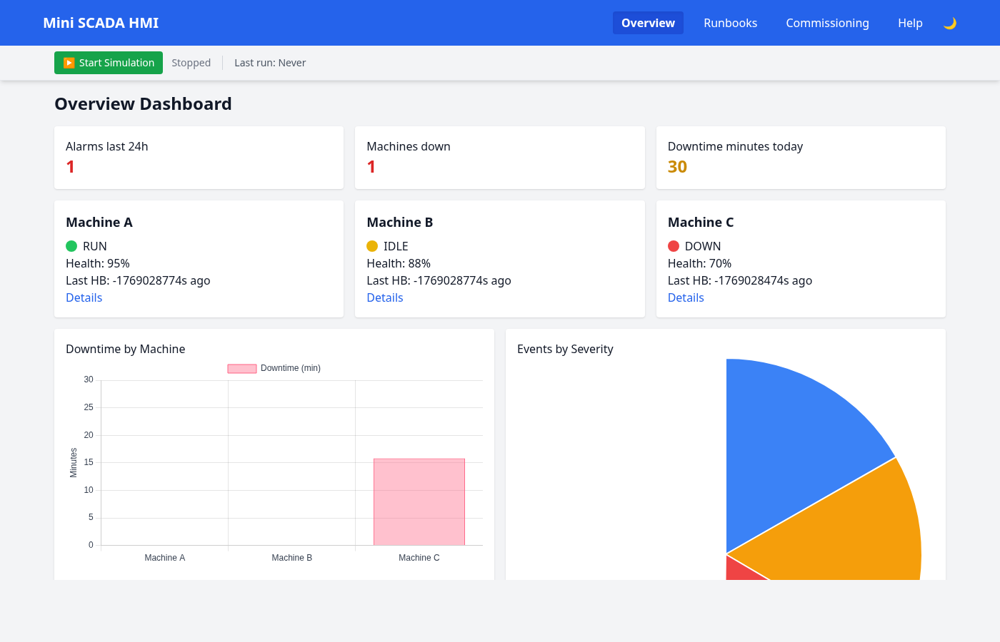
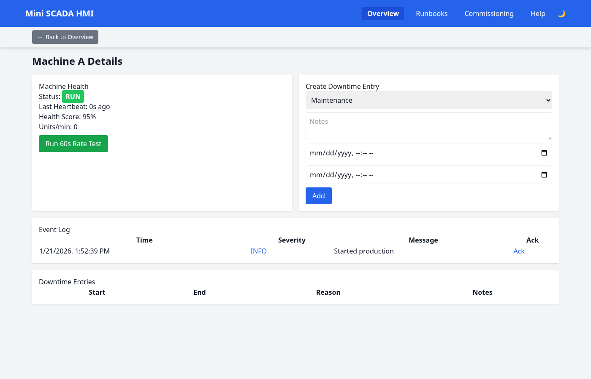
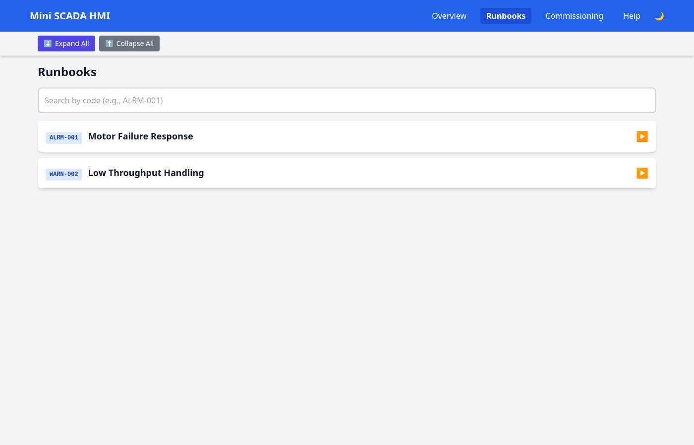
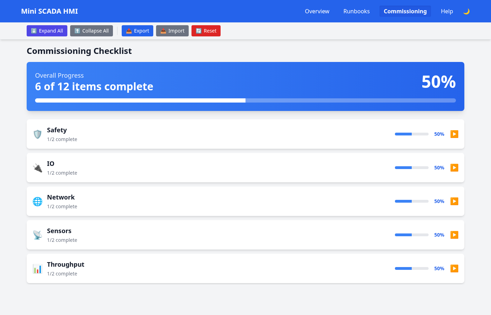
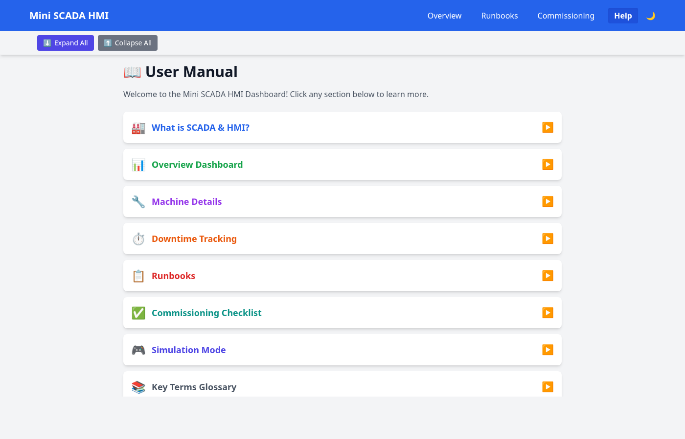

# Mini SCADA HMI Dashboard

<p align="center">
  
</p>

<h1 align="center">🏭 Mini SCADA HMI Dashboard</h1>

<p align="center">
  <strong>A zero-build, browser-ready demo of a SCADA Human-Machine Interface for factory monitoring</strong>
</p>

<p align="center">
  <a href="#quick-start">Quick Start</a> ·
  <a href="#features">Features</a> ·
  <a href="#screenshots">Screenshots</a> ·
  <a href="#technology-stack">Tech Stack</a> ·
  <a href="#glossary">Glossary</a> ·
  <a href="CONTRIBUTING.md">Contributing</a>
</p>

<p align="center">
  
  
  
  <br>
  
  
  
  
</p>

---

**Mini SCADA HMI Dashboard** is a zero-build, browser-ready simulation of an industrial Human-Machine Interface (HMI) for factory floor monitoring. It demonstrates SCADA concepts — alarm management, runbooks (SOPs), commissioning checklists (FAT/SAT), and real-time machine status — in a safe, offline-capable sandbox. Built for students learning industrial automation, developers exploring HMI/SCADA UI patterns, and trainers who need a demo environment without enterprise SCADA software. Runs directly from `index.html` with no server, no npm, and no bundler — all dependencies load via CDN.

> **SCADA** = Supervisory Control and Data Acquisition · **HMI** = Human-Machine Interface

---

<p align="center">
  
</p>

---

## Quick Start

Getting started takes less than 30 seconds.

**Option 1: Download and open (recommended)**

1. Click the green **"Code"** button → **"Download ZIP"**
2. Unzip anywhere on your computer
3. Double-click `index.html` — that's it! 🎉

**Option 2: Clone with Git**

```bash
git clone https://github.com/chf3198/mini-scada-hmi-dashboard.git
cd mini-scada-hmi-dashboard
open index.html        # macOS
xdg-open index.html    # Linux
start index.html       # Windows
```

> 💡 Works via `file://` protocol — no web server required!

---

## Features

<table>
<tr>
<td width="50%">

### 📊 Real-Time Dashboard
Live machine status cards with health scores. Color-coded severity indicators (🔴 Critical → 🟢 OK). Animated charts for downtime and events. Automatic refresh during simulation.

</td>
<td width="50%">

### 🔔 Alarm Management
Severity-based event logging with one-click acknowledgment. Timestamp tracking with relative time display. Filter events by machine.

</td>
</tr>
<tr>
<td width="50%">

### 📋 Runbooks (SOPs)
Searchable troubleshooting guides with accordion-style expandable sections. Step-by-step procedures for common issues. Ready for your custom procedures.

</td>
<td width="50%">

### ✅ Commissioning Checklists
FAT/SAT-style validation checklists with progress bars. LocalStorage persistence (survives page refresh). JSON export/import for sharing.

</td>
</tr>
<tr>
<td width="50%">

### 🎮 Simulation Mode
Start/stop realistic event generation with random alarm triggers and machine status changes. Perfect for demos and training.

</td>
<td width="50%">

### 🌙 Operator-Friendly UI
Dark mode for night shifts. Responsive design for tablets. Tooltips explain SCADA terminology. Built-in Help/User Manual page.

</td>
</tr>
</table>

---

## Screenshots

<table>
  <tr>
    <td align="center" width="50%">
      <strong>📊 Overview Dashboard</strong><br>
      
      <br><sub>Real-time machine status, KPIs, severity charts, and event log</sub>
    </td>
    <td align="center" width="50%">
      <strong>🔧 Machine Detail</strong><br>
      
      <br><sub>Drill-down view with metrics, alerts, and quick actions</sub>
    </td>
  </tr>
  <tr>
    <td align="center" width="50%">
      <strong>📋 Runbooks (SOPs)</strong><br>
      
      <br><sub>Searchable troubleshooting guides with step-by-step procedures</sub>
    </td>
    <td align="center" width="50%">
      <strong>✅ Commissioning Checklists</strong><br>
      
      <br><sub>FAT/SAT validation with progress tracking and persistence</sub>
    </td>
  </tr>
  <tr>
    <td align="center" colspan="2">
      <strong>❓ Help & User Manual</strong><br>
      
      <br><sub>Built-in documentation with SCADA terminology and app guidance</sub>
    </td>
  </tr>
</table>

---

## Project Structure

```
mini-scada-hmi-dashboard/
├── index.html         # Entry point — just open this
├── assets/
│   ├── app.js         # Main app logic, routing, views
│   ├── data.js        # Seed data (machines, events, runbooks)
│   ├── utils.js       # Helpers, simulation, persistence
│   ├── styles.css     # Minimal custom styles
│   └── tests.js       # Self-tests (run with ?test=1)
├── docs/
│   └── *.png          # Screenshots
├── LICENSE
├── README.md
└── CONTRIBUTING.md
```

Total codebase: ~800 lines — small enough to read in an afternoon.

---

## Technology Stack

All dependencies load via CDN — no npm, no webpack, no bundlers.

| Library | Purpose | Why It Was Chosen |
|---------|---------|-------------------|
| [Tailwind CSS](https://tailwindcss.com/) | Styling | Utility-first, no build required |
| [Chart.js](https://www.chartjs.org/) | Charts | Simple, beautiful, well-documented |
| [Lucide Icons](https://lucide.dev/) | Icons | Clean, open-source icon set |
| [Tippy.js](https://atomiks.github.io/tippyjs/) | Tooltips | Accessible, customizable |
| [Alpine.js](https://alpinejs.dev/) | Reactivity | Minimal declarative JS framework |

---

## Running Tests

```
index.html?test=1
```

Open in your browser with the test flag above and check the console. All tests should pass.

---

## Customization

| Customization | Difficulty | File to Edit |
|---------------|------------|--------------|
| Add more machines | ⭐ Easy | `assets/data.js` |
| Create new runbooks | ⭐ Easy | `assets/data.js` |
| Change color scheme | ⭐ Easy | Tailwind classes in `app.js` |
| Add new dashboard views | ⭐⭐ Medium | `assets/app.js` |
| Connect to real MQTT broker | ⭐⭐⭐ Advanced | New integration needed |
| Add OPC-UA data source | ⭐⭐⭐ Advanced | Backend required |

---

## From Demo to Production

This project is educational only. For real industrial deployments, you would need:

| Requirement | Description |
|-------------|-------------|
| **OPC-UA / MQTT** | Real protocol connections for live PLC data |
| **Authentication** | User login and role-based access (operators vs. admins) |
| **Historian database** | Store events and downtime in SQL/NoSQL for analysis |
| **WebSockets** | Push updates instead of polling |
| **Backend API** | Node.js or Python for data processing |
| **Redundancy** | High-availability architecture for critical systems |

---

## Contributing

Contributions are welcome — bug reports, feature suggestions, documentation improvements, and UI/UX enhancements. Read [CONTRIBUTING.md](CONTRIBUTING.md) before submitting a pull request.

---

## License

**[PolyForm Noncommercial 1.0.0](LICENSE)** — free for personal, educational, and non-commercial use. Commercial use requires a paid license. See [COMMERCIAL-LICENSE.md](COMMERCIAL-LICENSE.md) or contact [curtisfranks@gmail.com](mailto:curtisfranks@gmail.com).

© 2026 Curtis Franks

---

## Glossary

New to SCADA? Here are the key terms:

| Term | Definition |
|------|------------|
| **SCADA** | Supervisory Control and Data Acquisition — systems that monitor and control industrial processes |
| **HMI** | Human-Machine Interface — the screen operators use to interact with machines |
| **PLC** | Programmable Logic Controller — industrial computer that controls machinery |
| **OPC-UA** | Open Platform Communications Unified Architecture — industrial data exchange standard |
| **FAT** | Factory Acceptance Test — validation performed before shipping equipment |
| **SAT** | Site Acceptance Test — validation performed after installation on-site |

---

<p align="center">
  <strong>⭐ Found this useful? Give it a star!</strong><br>
  <sub>Built with ❤️ for the industrial automation community</sub>
</p>
